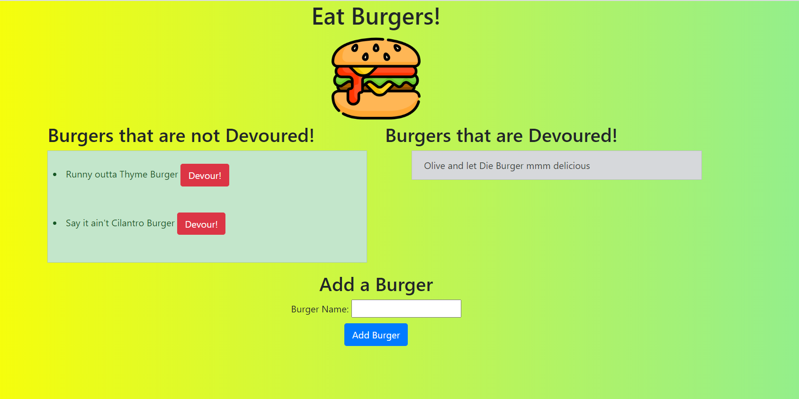

## Burger Eater

 ## Description
 this appl allows users to type the name of the burger they want to eat then click to devour it!

## Table of Contents
* [intsallation](#Installation)
* [usage](#Usage)
* [contributing](#Contributing)
* [Tests](#Tests)
* [User Story](#UserStory)
* [Github](#Github)

## Installation
follow herroku app for deployed link, if any editting is desired may need to npm install from the apps package json to run on localhost to install

## Usage
type the burger you want to eat, click add to add it, click devour and it will move to the devoureded side with "mmmdelicious" 

## Contributing
Jacob LaMarre contributed to the design.

## Tests
try these test commands: type names of your favorite burgers make sure add causes them to display on the left of the screen and that the devour moves them to the right of the screen. 

## UserStory
AS A Fan of Bob's Burgers
I WANT app that lets me display fun burger names and pretend to devour them 
SO THAT so that I can keep up with which fictional burgers I have devoured!!!! 
## Github
profile picture:JTLaMarre
email: lordaufchaos@yahoo.com

